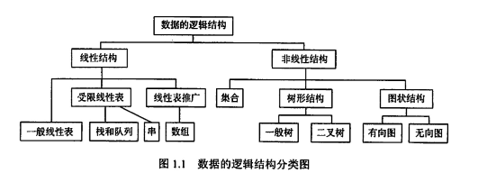
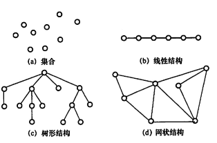

## 学习目标
数据结构三要素： 
逻辑结构
存储结构
数据的运算

五个特征：
算法定义
特征：有穷性、确定性、可行性、输入、输出
效率的衡量：时间复杂度、空间复杂度


## 数据结构的基本概念
数据，数据元素，数据对象，数据类型，数据结构

## 数据结构的三要素
1. 逻辑结构
逻辑结构指的是数据元素之间的逻辑关系，即从逻辑关系上描述数据。
它与数据的存储无关，是独立于计算机的。数据的逻辑结构分为线性结构和非线性结构，线性代表是典型的数据结构；
集合、树、图、是典型的非线性结构。


集合：各个元素同属于ige集合，别无其他关系（比如数据库查找出一个EmployeeList）
线性结构：一对一 除了第一个元素，所有元素都有唯一前驱，除了最后一个元素，所有元素都有唯一后继（栈队列）
树形结构：一对多 思维导图，文件系统
图：多对多

2. 存储结构
存储结构是指数据结构在计算机中的表示
有：
* 顺序存储
逻辑上相邻的元素存储在物理位置上也相邻的存储单元中
优点：随机存储，每个元素占用最少空间
缺点：只能使用相邻的一整块存储单元

* 链式存储 
不要求逻辑上相邻的元素在物理上也相邻，借助元素存储地址的指针来表示元素之间的逻辑关系
优点：充分利用空间
缺点：只能实现顺序存储且指针占空间

* 索引存储
在存储元素信息同时，还能附加的简历索引表，索引表中的每一项称为索引项，

* 散列存储
根据元素的关键字直接计算出该元素的存储地址，又称为哈希，
优点：检索，增加和删除都很快，
缺点：散列不好容易产生冲突




若采用顺序存储，则各个元素在物理上必须是连续的，若采用非顺序存储，则各个元素在物理上可以是离散的
数据的存储结构会影响存储空间分配的方便程度，影响数据的运算速度

3. 数据的运算
施加在数据上的运算包括运算的定义和实现。运算的定义是针对逻辑结构的，指出运算的功能；运算的实现是针对存储结构。

数据类型、抽象数据类型
数据类型：一个值的集合定义在此集合上的一组操作总称
原子类型：值不可再分的数据类型
结构类型：其值可再分解成若干分量的数据类型

## 算法

程序 = 数据结构 + 算法 

参考：https://blog.csdn.net/zolalad/article/details/11848739

### 时间复杂度
T(n)

* O(1)常数阶
O(1) 复杂度算法也称之为常数阶算法，也就是说这个算法的效率是固定的，无论你的数据量如何变化，效率都一样，这种复杂度也是最优的一种算法。
* O(n) 线性阶
```
public static void print1(int n){
    int a = 0;
    for (int i=0;i<n;i++){
        System.out.println(i);
    }
}
```
* O(n²) 平方阶
for
    for

* O(logn) 对数阶
O(logn) 也称之为对数阶，对数阶也很常见，像二分查找，二叉树之类的问题中会见到比较多的对数阶复杂度，但是对数阶也是比较难理解的一种算法复杂度。
```
public static void print2(int n){
    int i=1;
    while (i <= n) {
        i = i * 2;
    }
}
```

* O(nlogn) 线性对数阶


### 空间复杂度